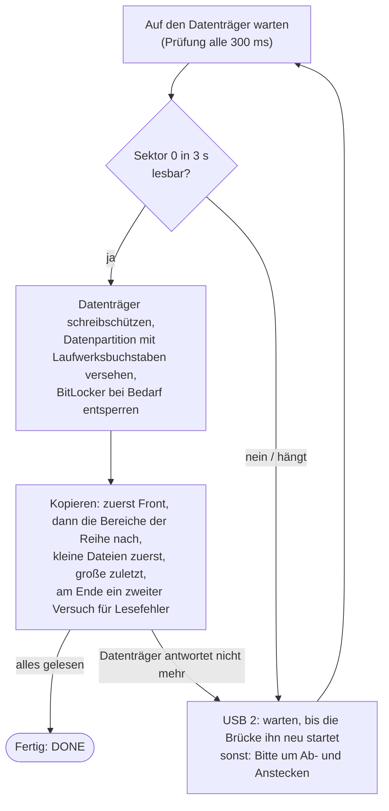

# Samsung 950 PRO Data Recovery

**Dateien von einem Datenträger retten, der nur noch Sekunden am Stück funktioniert – nur lesend, fortsetzbar,
in einer automatischen Schleife aus Warten → Kopieren → Weitermachen.**

Ein einzelnes Windows-PowerShell-Skript, ohne Installation. Entstanden ist es bei einer echten Rettung: eine
sterbende Samsung 950 PRO SSD, die nach jedem Einschalten etwa 11 Sekunden lang lesbar war. 563 Einschaltzyklen
später waren alle 269.007 Dateien (159 GB) gesichert, die wir haben wollten – keine einzige mit bleibendem
Lesefehler. Der Name kommt von dieser SSD; das Werkzeug passt für jeden Datenträger, der auf dieselbe Art
ausfällt.

English: [README.md](README.md)

> [!CAUTION]
> **Wenn gerade ein Datenträger stirbt:** ausschalten und [Ist das das richtige Werkzeug?](#ist-das-das-richtige-werkzeug)
> sowie [Schritt für Schritt](#schritt-für-schritt) lesen, bevor er wieder angeschlossen wird. **Kein** chkdsk und
> kein „Scannen und reparieren“, **nicht** initialisieren oder formatieren, wenn Windows es anbietet, und nicht
> damit weiterarbeiten. Jede Minute Laufzeit und jeder Schreibzugriff kann es schlimmer machen.

## Inhalt

- [Ist das das richtige Werkzeug?](#ist-das-das-richtige-werkzeug)
- [Was passiert ist: die Geschichte hinter dem Werkzeug](#was-passiert-ist-die-geschichte-hinter-dem-werkzeug)
- [So funktioniert es](#so-funktioniert-es)
- [Voraussetzungen](#voraussetzungen)
- [Schritt für Schritt](#schritt-für-schritt)
- [Automatisches Einbinden und Schreibschutz: warum das wichtig ist](#automatisches-einbinden-und-schreibschutz-warum-das-wichtig-ist)
- [BitLocker](#bitlocker)
- [USB 2 oder USB 3?](#usb-2-oder-usb-3)
- [Interner Steckplatz: Rettung beim Hochfahren](#interner-steckplatz-rettung-beim-hochfahren)
- [Die Ausgabe lesen](#die-ausgabe-lesen)
- [Was im Zielordner landet](#was-im-zielordner-landet)
- [Konfiguration](#konfiguration)
- [Befehlszeile](#befehlszeile)
- [Werkzeuge und Tests](#werkzeuge-und-tests)
- [Was wir gelernt haben](#was-wir-gelernt-haben)
- [Grenzen](#grenzen)
- [Lizenz](#lizenz)

## Ist das das richtige Werkzeug?

Gedacht ist es für Datenträger, die **noch funktionieren, aber nur kurz**. Es passt, wenn alles davon zutrifft:

- Nach dem Einschalten wird der Datenträger **erkannt**, mit richtigem Namen und richtiger Größe (in der
  Datenträgerverwaltung oder mit `.\Rescue-Disk.ps1 -ListDisks`).
- Er **liest eine Weile** – Sekunden bis wenige Minuten – und **hängt dann oder verschwindet**. Typische Anzeichen:
  Der Explorer friert ein, der Laufwerksbuchstabe verschwindet, die Datenträgerverwaltung zeigt den Datenträger als
  *Nicht initialisiert* oder mit 0 Byte, im System-Ereignisprotokoll stehen `disk`-Ereignisse 153 oder 157 oder
  Controller-Resets.
- Er **kommt nach dem Aus- und Einschalten wieder**: USB-Gehäuse abstecken und wieder anstecken, oder den PC
  herunterfahren und wieder einschalten.
- Seine Datenpartition hat ein **Dateisystem, das Windows lesen kann** (getestet mit NTFS).

Typische Kandidaten: SSDs mit sterbendem Controller oder fehlerhafter Firmware, NVMe-SSDs, die vom Bus fallen,
Datenträger in USB-Gehäusen, die nach einer Weile die Verbindung verlieren.

**Nicht** das richtige Werkzeug:

| Situation | Stattdessen |
|---|---|
| Eine Festplatte klickt, schleift, piept oder läuft immer wieder an und aus | Sofort ausschalten – jeder Start kann sie weiter beschädigen. Ab ins Datenrettungslabor. |
| Der Datenträger wird gar nicht erkannt, oder mit falschem Namen oder falscher Größe (0 GB, „SATAFIRM S11“, …) | Controller oder Firmware sind ausgefallen. Datenrettungslabor. |
| Der Datenträger läuft durchgehend, aber manche Bereiche sind nicht lesbar | Ein Sektor-Abbild mit Wiederholungsversuchen erstellen, z. B. mit [GNU ddrescue](https://www.gnu.org/software/ddrescue/) von einem Linux-Live-USB-Stick, und die Dateien aus dem Abbild retten. |
| Gelöschte Dateien, formatierte oder beschädigte Partition | Mit Werkzeugen wie [TestDisk/PhotoRec](https://www.cgsecurity.org/) auf einem Abbild arbeiten, nie auf dem Original. |
| Dynamische Datenträger, Speicherplätze (Storage Spaces), RAID, Linux- oder macOS-Dateisysteme | Nicht unterstützt. |

Wenn die Daten unersetzlich sind und es keine Sicherung gibt, zuerst an ein professionelles Labor denken: Dieses
Werkzeug braucht viele Einschaltzyklen, und jeder davon ist ein Risiko für einen sterbenden Datenträger.

## Was passiert ist: die Geschichte hinter dem Werkzeug

Im September 2026 fiel die Daten-SSD unseres Laptops aus: eine **Samsung 950 PRO 512 GB** (M.2 NVMe, Baujahr
2015), mit **BitLocker** verschlüsselt, mit 159 GB in rund 270.000 Dateien – Quellcode, Dokumente, Mail-Archive,
virtuelle Maschinen.

Es gab Vorwarnungen. Die eigenen Aufzeichnungen von Windows (siehe
[`tools/Get-DiskHistory.ps1`](tools/Get-DiskHistory.ps1)) zeigen, dass sie Anfang 2025 dreimal und im Juni 2026
einmal vom Bus gefallen war und jedes Mal nach einem Neustart wieder da war. Am 24. September 2026 fiel sie
endgültig aus: Nach jedem Einschalten lief sie kurz, dann hing sie und verschwand. Solange sie hing, zeigte die
Datenträgerverwaltung sie als *Nicht initialisiert*.

**1. Im Laptop, Lesen beim Hochfahren.** Im Steckplatz starb die SSD 66 bis 100 Sekunden nach dem Einschalten.
Eine geplante Aufgabe startete die Rettung bei jedem Hochfahren, um diese Minute zu nutzen. Das brachte kaum
etwas: Direkt nach dem Hochfahren kannte der Speicherdienst von Windows die SSD oft noch gar nicht, und ein
Neustart weckte sie nicht auf – sie brauchte jedes Mal ein vollständiges Herunterfahren und Einschalten.

**2. USB-Gehäuse, USB 3.** Wir bauten die SSD in ein USB-Gehäuse mit einer JMicron-JMS583-Brücke (USB auf NVMe).
Jetzt las sie pro Einschaltzyklus etwa 12 Sekunden lang, dann hing sie – und blieb hängen, bis das Gehäuse
abgesteckt wurde. Den USB-Anschluss per Software neu zu starten oder das USB-Gerät zu deaktivieren und wieder zu
aktivieren, half nie: Die SSD behielt ihren Strom, und nur echtes Stromlos-Machen half. Also: abstecken,
anstecken, 12 Sekunden, und wieder von vorn.

**3. Dasselbe Gehäuse an USB 2.** Der Durchbruch. Über USB 2 las die SSD zwar auch nur etwa 11 Sekunden lang (mit
etwa 36 MB/s, der Grenze von USB 2) – aber wenn sie hing, startete der Brückenchip sie von selbst neu, nachdem
Windows das USB-Gerät zurückgesetzt hatte. Die SSD verschwand und war etwa zehn Sekunden später wieder lesbar,
ohne dass jemand sie anfasste. Ab da lief die Rettung von allein: ungefähr alle 22 Sekunden ein neuer Durchgang,
30 bis 40 GB pro Stunde. In 468 Durchgängen über USB 2 musste das Skript nur 6-mal darum bitten, das Kabel neu
anzustecken.

Das Ergebnis:

| | |
|---|---|
| Gesicherte Dateien | **269.007 (159 GB)** – alles außer Ordnern, die wir bewusst ausgelassen haben, weil es sie anderswo gibt (Repository-Klone, Build-Ausgaben) |
| Dateien mit bleibenden Lesefehlern | **0** |
| Lese-Durchgänge | 563 |
| Zeit, in der die SSD tatsächlich Daten lieferte | insgesamt 2 h 10 min |
| Dauer | ein Nachmittag und Abend, dazu 40 Minuten am nächsten Tag |

Die Partition war mit BitLocker verschlüsselt, und wir hatten Glück: Windows entsperrte sie jedes Mal
automatisch, weil für dieses Laufwerk auf diesem Laptop die automatische Entsperrung aktiv war. Ohne sie hätte
jeder Durchgang den Wiederherstellungsschlüssel gebraucht – siehe [BitLocker](#bitlocker).

Das Skript ist während der Rettung gewachsen, Version für Version, aus dem, was uns jeder Fehlschlag beigebracht
hat. Dieses Repository enthält die aufgeräumte Fassung: dieselbe Logik, mit einer Konfigurationsdatei statt
unserer Ordnernamen, englischen Meldungen und einem Selbsttest.

## So funktioniert es



- **Nur lesend.** Bevor irgendetwas über das Dateisystem gelesen wird, setzt das Skript das Schreibschutz-Attribut
  des Datenträgers (`Set-Disk -IsReadOnly`); Windows merkt es sich für die nächsten Verbindungen. Dateien werden mit
  reinen Lese-Handles geöffnet, geschrieben wird nur unterhalb des Zielordners. Der Datenträger mit Windows und der
  mit dem Ziel werden nie angefasst, und wenn mehr als ein Datenträger zum eingestellten Namen passt, hört das
  Skript auf, statt zu raten.
- **Nichts doppelt.** `<Ziel>\_state` hält fest: die vollständige Dateiliste jedes Bereichs, während sie entsteht
  (Ordner für Ordner), jede fertige Datei und wie weit große Dateien gekommen sind (alle 8 MB gespeichert). Kommt der
  Datenträger zurück, macht die Schleife genau dort weiter, wo sie aufgehört hat – auch mitten in einer Datei, und
  auch, wenn das Skript beendet und Tage später wieder gestartet wird.
- **Eine sinnvolle Reihenfolge.** Zuerst die `Front`-Dateien und -Ordner (eine Passwortdatenbank, ein
  Mail-Archiv, …), vollständig. Dann die `Areas` (Bereiche) in der eingestellten Reihenfolge, dann der Rest der
  Partition. Innerhalb eines Bereichs zuerst die kleinen Dateien – die meisten Dateien in der kürzesten Zeit –, dann
  Mediendateien und Datenträger-Abbilder, dann die als `Late` markierten Ordner. Dateien über `BigMB` kommen in einem
  letzten Durchgang über alle Bereiche, und Dateien mit Lesefehlern bekommen ganz am Ende einen zweiten Versuch.
- **Schnelle Reaktion.** Wenn der Datenträger nicht mehr antwortet, kann Windows 40 Sekunden und länger brauchen,
  bis es einen Lesevorgang aufgibt. Ein Watchdog meldet es nach 3 Sekunden und sagt nach `HangSeconds` (5), was zu
  tun ist.
- **Kein Festfahren.** Ein Lesefehler legt die Datei für den zweiten Versuch beiseite. Hängt der Datenträger
  dreimal an genau derselben Stelle einer Datei, wird sie ebenfalls zurückgestellt, damit eine einzelne schlechte
  Stelle nicht alles andere blockiert; nach drei weiteren Hängern dort gibt das Skript diese Datei auf, damit die
  Rettung fertig werden kann. Die Zählung übersteht Neustarts. Solche Dateien stehen in `_state\failed.tsv`.
- Kopien behalten das Änderungsdatum der Datei. Dateien, die schon mit gleicher Größe und gleichem Datum im Ziel
  liegen (etwa von einem früheren robocopy-Versuch), werden nicht noch einmal gelesen.

## Voraussetzungen

- Windows 10 oder 11 mit **Windows PowerShell 5.1** (Teil von Windows; PowerShell 7 ist nicht getestet).
- **Administratorrechte**.
- Ein **Ziellaufwerk** – nicht der sterbende Datenträger, keine Netzwerkfreigabe – mit genug freiem Platz für
  alles, was gerettet werden soll. Empfohlen ist NTFS (große Dateien, lange Pfade).
- Für USB: ein Gehäuse oder Adapter, der zum Datenträger passt (SATA oder NVMe – bei M.2 auf die Kodierung achten).
  Am besten auch eine Möglichkeit, ihn über USB 2 anzuschließen, siehe [USB 2 oder USB 3?](#usb-2-oder-usb-3)
- Für einen BitLocker-verschlüsselten Datenträger aus einem anderen PC: sein 48-stelliger
  Wiederherstellungsschlüssel, siehe [BitLocker](#bitlocker).

## Schritt für Schritt

### 1. Werkzeug vorbereiten

Dieses Repository herunterladen (**Code → Download ZIP**) und auf einem gesunden Laufwerk entpacken, z. B. nach
`C:\Tools`. **Windows PowerShell als Administrator** öffnen (Startmenü → `powershell` tippen → *Als Administrator
ausführen*) und in den entpackten Ordner wechseln:

```powershell
cd C:\Tools\Samsung-950-Pro-Data-Recovery-main
Get-ChildItem -Recurse | Unblock-File                              # Dateien aus dem Internet sind blockiert
Set-ExecutionPolicy -Scope Process -ExecutionPolicy Bypass -Force  # Skripte nur in diesem Fenster erlauben
```

Optional prüfen, ob das Skript auf diesem PC läuft – ohne Datenträger, in wenigen Sekunden:

```powershell
.\tests\Test-RescueDisk.ps1
```

Am Ende sollte `All checks passed.` stehen.

### 2. Automatisches Einbinden abschalten – bevor der Datenträger angeschlossen wird

```powershell
.\Rescue-Disk.ps1 -Prepare
```

Das führt `mountvol /N` aus (Windows bindet neue Volumes nicht mehr ein und vergibt keine Laufwerksbuchstaben) und
`mountvol /R` (Windows vergisst die Laufwerksbuchstaben von Volumes, die nicht angeschlossen sind – auch den alten
Buchstaben des sterbenden Datenträgers). Ohne das gibt Windows der Partition in dem Moment einen
Laufwerksbuchstaben, in dem der Datenträger auftaucht, und Explorer, automatische Wiedergabe, Virenscanner,
Suchindizierung und Windows selbst fangen an, ihn zu benutzen – und schreiben womöglich darauf –, bevor irgendetwas
ihn schreibgeschützt hat. Details: [Automatisches Einbinden und
Schreibschutz](#automatisches-einbinden-und-schreibschutz-warum-das-wichtig-ist).

Solange das automatische Einbinden aus ist, bekommen auch andere neu angeschlossene Laufwerke (auch USB-Sticks)
keinen Buchstaben; bei Bedarf in der Datenträgerverwaltung einen vergeben. Schritt 7 schaltet es wieder ein.

Wird später die Anschlussart des sterbenden Datenträgers geändert (anderes Gehäuse, oder von USB in einen internen
Steckplatz), `-Prepare` noch einmal ausführen, während er abgesteckt ist.

### 3. Datenträger anschließen und seinen Namen herausfinden

Datenträger anschließen. Bietet Windows an, ihn zu scannen und zu reparieren, zu formatieren oder zu
initialisieren: schließen bzw. abbrechen – jedes Mal. Dann:

```powershell
.\Rescue-Disk.ps1 -ListDisks
```

```text
Disk            Vendor and product (-Model)              Notes
PhysicalDrive0  NVMe Samsung SSD 980 1TB                 system or target disk - never used
PhysicalDrive2  Samsung SSD 950 PRO                      USB port 13, USB 2, VID_152D&PID_0583
```

Den Namen des sterbenden Datenträgers notieren. Er kann je nach Anschluss anders lauten: Unsere SSD hieß im Laptop
`NVMe Samsung SSD 950 PRO 512GB` und im USB-Gehäuse `Samsung SSD 950 PRO` – deshalb haben wir `SSD 950 PRO`
verwendet, das zu beidem passt. Es macht nichts, wenn der Datenträger inzwischen wieder ausgestiegen ist.
`.\tools\Get-DiskHistory.ps1` zeigt die Namen aller Datenträger, die Windows im letzten Jahr gesehen hat, auch wenn
sie gerade nicht angeschlossen sind.

### 4. Konfiguration schreiben

`rescue-config.example.psd1` im selben Ordner als `rescue-config.psd1` kopieren und bearbeiten (der Editor reicht).
Darin sind nur `Model` und `Target` aktiv; die übrigen Einstellungen sind auskommentierte Beispiele. Das Minimum:

```powershell
@{
    Model  = 'SSD 950 PRO'   # Teil des Namens aus -ListDisks (ein regulärer Ausdruck)
    Target = 'E:\Rescue'     # ein Ordner auf einem anderen Datenträger
}
```

Dann festlegen, was am wichtigsten ist. Alle Pfade sind relativ zum Stammverzeichnis der sterbenden Partition, ohne
Laufwerksbuchstaben (ein Pfad mit Laufwerksbuchstaben wird abgelehnt – die Kopie würde das Original überschreiben):

```powershell
    Areas   = @('Users\anna\Documents', 'Users\anna\Desktop', 'Projects')   # Wichtigstes zuerst
    Front   = @('Users\anna\Documents\passwords.kdbx')                      # zuerst, vollständig, in jedem Durchgang
    Late    = @{ 'Projects\old-archive' = 1 }                               # zuletzt im Bereich
    Exclude = @('Projects\third-party\chromium')                            # gar nicht
```

Bereiche machen viel aus: Ohne sie listet das Skript die ganze Partition auf, bevor es die erste Datei kopiert.
[`rescue-config.example.psd1`](rescue-config.example.psd1) erklärt jede Einstellung (auf Englisch); siehe auch
[Konfiguration](#konfiguration). Umlaute in Pfaden sind kein Problem, auch wenn der Editor die Datei als UTF-8
ohne BOM speichert.

Unsicher bei den Ordnernamen? Nur mit `Model` und `Target` anfangen. Die Dateilisten landen in
`<Ziel>\_state\inv_*.tsv`, sobald sie gelesen sind (eine Zeile pro Datei: `F`, Pfad, Größe, Zeit). Hineinschauen,
das Skript mit Strg+C stoppen, `Areas` ergänzen und neu starten. Es geht nichts verloren: Was aufgelistet oder
gesichert ist, bleibt aufgelistet und gesichert.

### 5. Rettung starten

```powershell
.\Rescue-Disk.ps1
```

Das Fenster offen lassen. Das Skript wartet auf den Datenträger, schützt ihn gegen Schreiben, gibt der Partition
den Buchstaben `R:` (Einstellung `Letter`) und kopiert, bis der Datenträger nicht mehr antwortet. Dann:

- **Über USB 2** wartet es, bis die Brücke im Gehäuse den Datenträger von selbst neu startet: *The disk hangs - over
  USB 2 the USB bridge usually restarts it by itself, please wait a moment.* Ist er nach etwa einer Minute nicht
  zurück, abstecken und wieder anstecken.
- **Sonst** bittet es: *Please unplug the disk and plug it in again - the rescue continues exactly where it
  stopped.* Abstecken, etwa fünf Sekunden warten, damit der Datenträger wirklich stromlos wird, wieder anstecken.
- **In einem internen Steckplatz:** siehe [Interner Steckplatz: Rettung beim
  Hochfahren](#interner-steckplatz-rettung-beim-hochfahren).

Nach jedem Durchgang zeigt eine Zusammenfassung, was gesichert wurde und was noch offen ist (siehe [Die Ausgabe
lesen](#die-ausgabe-lesen)). Alles außer den Fortschritts- und Watchdog-Zeilen steht auch in `<Ziel>\rescue.log`.

Mit **Strg+C** lässt sich das Skript jederzeit anhalten – am besten, während *Waiting for the disk ...* dasteht –
und später wieder starten; es geht dort weiter, wo es aufgehört hat. Die Konfiguration darf dazwischen geändert
werden (außer `Target`). `SkipDirs`, `SkipRootDirs` und das Entfernen eines `Exclude`-Eintrags wirken nur auf Ordner,
die noch nicht aufgelistet sind.

Während es läuft: den Datenträger nicht im Explorer oder in anderen Programmen öffnen (das geht von seinen wenigen
Sekunden ab) und dafür sorgen, dass der PC nicht in den Energiesparmodus geht. Ein Klick ins Fenster hält das Skript
nicht an (es schaltet den Bearbeitungsmodus „QuickEdit“ ab, solange es läuft). Meldungen von Windows wie *Fehler
beim verzögerten Schreibvorgang* für das gerettete Laufwerk bedeuten, dass Windows darauf schreiben wollte und
abgewiesen wurde – einfach schließen.

### 6. Wenn DONE erscheint

```text
DONE - everything readable has been read. Files with permanent read errors: 0 (see _state\failed.tsv).
```

Das Ergebnis pro Ordner prüfen:

```powershell
.\tools\Get-RescueReport.ps1 -Target E:\Rescue
```

`_state\failed.tsv` listet die Dateien mit bleibenden Lesefehlern und die Stelle, an der das Lesen scheiterte; ihre
Kopien enthalten alles bis dahin. Auch Ordner, die sich nicht auflisten ließen, stehen darin, mit `\` am Ende (die
DONE-Zeile nennt dann zusätzlich *folders that could not be listed: N*) – die Dateien darin fehlen. Wird vor DONE
aufgehört, sind unterbrochene Dateien im Ziel kürzer als auf dem Datenträger; `Get-RescueReport.ps1 -List` zählt sie
auf.

### 7. Abschließen

```powershell
.\Rescue-Disk.ps1 -Finish
```

Das schaltet das automatische Einbinden wieder ein (`mountvol /E`) und entfernt die Autostart-Aufgabe, falls eine
eingerichtet war. Den sterbenden Datenträger abstecken.

Dann die Dateien an ihren neuen Platz kopieren. Der Zielordner hat denselben Aufbau wie die gerettete Partition,
dazu `_state` und `rescue.log`:

```powershell
robocopy E:\Rescue D:\Restored /E /DCOPY:T /XD E:\Rescue\_state /XF E:\Rescue\rescue.log
.\tools\Get-RescueReport.ps1 -Target E:\Rescue -RestoredTo D:\Restored
```

Den Rettungsordner behalten, bis alles geprüft ist.

## Automatisches Einbinden und Schreibschutz: warum das wichtig ist

Von einem sterbenden Datenträger soll gelesen werden, und nur gelesen. Jeder Schreibvorgang macht dem versagenden
Controller zusätzliche Arbeit, ein unterbrochener Schreibvorgang kann das Dateisystem weiter beschädigen, und jede
Sekunde, die mit Schreiben vergeht, fehlt beim Lesen.

Windows schreibt aber von sich aus auf Datenträger. Taucht eine Partition auf, gibt Windows ihr einen
Laufwerksbuchstaben und bindet sie ein; Explorer, automatische Wiedergabe, Virenscanner und Suchindizierung
beginnen zu lesen, und das Dateisystem selbst schreibt womöglich: NTFS schreibt sein Journal zurück und aktualisiert
Metadaten, und BitLocker repariert seine eigenen Metadaten, wenn es eine beschädigte Kopie findet.

Das ist keine Theorie. Das Ereignisprotokoll von Windows zeigt genau das während unserer Rettung: NTFS wollte sein
Transaktionsprotokoll zurückschreiben und in die `$MFT` schreiben, und nach einem fehlgeschlagenen Lesen startete
BitLocker eine „Selbstheilung“ seiner Metadaten. Windows hat alles mit *Write Protect Error* abgewiesen – der
Datenträger war schreibgeschützt.

Das Skript schützt den Datenträger auf zwei Wegen:

1. **`-Prepare`, vor dem ersten Anschließen:** automatisches Einbinden aus (`mountvol /N`), damit die Partition
   keinen Laufwerksbuchstaben bekommt und in Ruhe gelassen wird, und alte Laufwerksbuchstaben vergessen
   (`mountvol /R`), damit sie auch ihren alten Buchstaben nicht zurückbekommt. Windows merkt sich
   Laufwerksbuchstaben pro Partition – auch dann, wenn der Datenträger plötzlich über USB statt intern angeschlossen
   ist. (Dasselbe mit diskpart: `automount disable` und `automount scrub`.)
2. **Das Schreibschutz-Attribut:** Das Skript setzt es, bevor es der Partition einen Laufwerksbuchstaben gibt.
   Windows merkt es sich für diesen Datenträger: Beim nächsten Auftauchen ist er vom ersten Moment an
   schreibgeschützt und bekommt gleich seinen Buchstaben `R:`, was in jedem Durchgang Zeit spart.

Eine Einschränkung aus unserem Ereignisprotokoll: Nachdem das Attribut einmal gesetzt war, kam der Datenträger bei
604 von 605 Verbindungen von selbst schreibgeschützt hoch. Einmal kam er aus unbekanntem Grund beschreibbar hoch und
war etwa drei Sekunden lang eingebunden, bis das Skript das Attribut wieder gesetzt hatte – genau da passierten die
Schreibversuche oben. Deshalb prüft das Skript das Attribut bei jeder Verbindung, und deshalb sollte `-Prepare` nach
einem Wechsel des Gehäuses oder der Anschlussart noch einmal laufen: Windows speichert das Attribut pro Gerät, so
wie es angeschlossen ist (bei uns war es für das USB-Gehäuse gesetzt, für die internen Steckplätze nicht), den
Laufwerksbuchstaben aber für die Partition selbst.

Das Attribut bleibt für diesen Datenträger auf diesem PC nach der Rettung gesetzt. Auf den Datenträger wird man
kaum mehr schreiben wollen; falls doch: `Set-Disk -Number <n> -IsReadOnly $false`.

## BitLocker

Eine mit BitLocker verschlüsselte Partition muss entsperrt werden, bevor ihre Dateien lesbar sind. Es gibt zwei
Fälle.

**Der Datenträger stammt aus diesem PC, mit automatischer Entsperrung – unser Fall.** Bei Datenlaufwerken kann
BitLocker den Schlüssel auf dem PC hinterlegen, sodass Windows das Laufwerk automatisch entsperrt, sobald es
auftaucht („automatische Entsperrung“, engl. *auto-unlock*); verwaltete Firmen-PCs sind typischerweise so
eingerichtet. Dann ist nichts zu tun: Jedes Mal, wenn unsere SSD zurückkam, war sie schon entsperrt – auch, als das
Skript beim Hochfahren als SYSTEM lief, bevor sich jemand angemeldet hatte. Bestätigt haben wir es hinterher aus den
Aufzeichnungen von Windows: BitLocker-Ereignisse für die gerettete Partition und der einzige Eintrag für
automatische Entsperrung auf dem Laptop, der vom Tag der Einrichtung des Laptops stammt und zu keinem seiner
anderen Laufwerke gehört.

Dieser Schlüssel liegt in der Windows-Installation dieses PCs. Wäre der Laptop auch ausgefallen oder Windows neu
installiert worden, wäre die Partition gesperrt gewesen.

**Jeder andere Fall – anderer PC, neue Windows-Installation** – braucht den **48-stelligen
Wiederherstellungsschlüssel**. Zu finden:

- privates Microsoft-Konto: <https://aka.ms/myrecoverykey>
- Firmen- oder Schul-PC: die IT-Abteilung, oder <https://aka.ms/aadrecoverykey> (Microsoft Entra ID), oder Active
  Directory
- ein Ausdruck oder eine Textdatei, die beim Einschalten von BitLocker gespeichert wurde

Den Schlüssel in eine Textdatei schreiben (erste Zeile; Bindestriche sind egal), irgendwo außerhalb dieses
Ordners, und in der Konfiguration darauf verweisen:

```powershell
    BitLockerKeyFile = 'C:\Private\bitlocker-recovery.txt'
```

Ohne `BitLockerKeyFile` fragt das Skript einmal nach dem Schlüssel und behält ihn für alle weiteren Durchgänge im
Speicher (die Autostart-Aufgabe kann nicht fragen – sie braucht die Datei). Entsperrt wird mit `Unlock-BitLocker`
(BitLocker-PowerShell-Modul, Teil von Windows Pro, Enterprise und Education). Zum Entsperren muss nur gelesen werden
– und der Datenträger ist ohnehin schreibgeschützt. Die Schlüsseldatei nach der Rettung löschen. Sind die
BitLocker-Metadaten auf dem Datenträger beschädigt, hilft auch der Schlüssel nicht; dann sind ein Sektor-Abbild und
`repair-bde` der nächste Schritt, oder ein Labor.

**Nicht** auf dem sterbenden Datenträger die automatische Entsperrung einschalten, Schlüsselschutzvorrichtungen
hinzufügen oder entfernen, BitLocker anhalten oder entschlüsseln: All das schreibt auf den Datenträger (und
scheitert auf einem schreibgeschützten Datenträger sowieso).

Tipp für alle, heute noch: die Wiederherstellungsschlüssel der eigenen Laufwerke heraussuchen, solange alles
funktioniert. In einer Administrator-PowerShell zeigt `manage-bde -protectors -get D:` den
Wiederherstellungsschlüssel von Laufwerk D:.

Der Entsperr-Schritt ist nicht mit einem gesperrten, sterbenden Datenträger getestet – unserer hat ihn nie
gebraucht.

## USB 2 oder USB 3?

Unsere Beobachtungen mit derselben SSD im selben Gehäuse (JMicron JMS583):

| | Interner Steckplatz (NVMe) | USB 3 | USB 2 |
|---|---|---|---|
| Liest nach dem Einschalten | 66–100 s | etwa 12 s | etwa 11 s |
| Dann | tot, bis der PC heruntergefahren und eingeschaltet wird | hängt, bis abgesteckt wird | die Brücke startet die SSD nach etwa 10 s neu |
| Was man selbst tun muss | herunterfahren und einschalten, jedes Mal | abstecken und anstecken, jedes Mal | fast nichts (6 von 468 Durchgängen) |
| Ein Durchgang dauert | mehrere Minuten | so lange, wie man selbst braucht | etwa 22 s |

Also beides ausprobieren. Startet das Gehäuse den Datenträger auch über USB 3 von selbst neu, bei USB 3 bleiben – das
ist schneller. Hängt er, bis er abgesteckt wird, USB 2 probieren: ein USB-2-Anschluss am PC, ein USB-2-Hub oder ein
USB-2-Verlängerungskabel zwischen Gehäuse und PC. `-ListDisks` und die Zeile *Found the disk* zeigen, welche
Geschwindigkeit verwendet wird, und das Skript passt sich an: Über USB 2 wartet es bis zu 30 Sekunden auf die
Brücke, bevor es um Ab- und Anstecken bittet.

Was bei unserer SSD nicht geholfen hat – Software statt Kabel: den USB-Anschluss neu starten
(`IOCTL_USB_HUB_CYCLE_PORT`) und das USB-Gerät deaktivieren und wieder aktivieren. Beides startet nur die USB-Seite
neu; die SSD behält ihren Strom. Das Skript kann beides trotzdem mit `-PortRestart` versuchen (experimentell) –
andere Gehäuse schalten dabei vielleicht den Strom ab.

## Interner Steckplatz: Rettung beim Hochfahren

Lässt sich der Datenträger nur intern anschließen und stirbt er bald nach dem Einschalten, kann das Skript mit
Windows starten:

```powershell
.\Rescue-Disk.ps1 -InstallAutostart
```

Das kopiert das Skript und `rescue-config.psd1` nach `%ProgramData%\DiskRescue` (nur von Administratoren änderbar)
und richtet die geplante Aufgabe **DiskRescue** ein. Sie läuft bei jedem Start als SYSTEM, wartet bis zu 240
Sekunden auf den Datenträger und liest, bis er aussteigt. Dann, immer wieder:

1. Den PC **vollständig herunterfahren** und wieder einschalten: `shutdown /s /t 0`. Nicht *Neu starten* – dabei
   bleibt der Datenträger womöglich unter Strom, und unserer wurde nach einem Neustart nicht einmal erkannt. Und
   nicht einfach *Herunterfahren* im Startmenü, wenn der Schnellstart aktiv ist: Dann geht Windows nur in den
   Ruhezustand, und Aufgaben, die beim Start laufen sollen, laufen nicht.
2. Anmelden und das Protokoll beobachten: `Get-Content E:\Rescue\rescue.log -Wait -Tail 30`
3. Ist der Datenträger ausgestiegen, von vorn.

Die Aufgabe verwendet ihre eigene Kopie der Konfiguration: Nach einer Änderung an `rescue-config.psd1`
`-InstallAutostart` noch einmal ausführen. Solange die Aufgabe läuft, beendet sich eine zweite Instanz des Skripts
sofort (*A rescue is already running*). `.\Rescue-Disk.ps1 -RemoveAutostart` entfernt die Aufgabe, `-Finish`
ebenso. Nie für den Datenträger verwenden, von dem Windows läuft – so einen an einen anderen PC anschließen.

## Die Ausgabe lesen

Ein Durchgang über USB 2 (gekürzt; die Zahlen erscheinen im Format der Regionseinstellungen, also z. B. mit
Dezimalkomma):

```text
21:14:02 (+ 812s since boot) Waiting for the disk ...
21:14:19 (+ 829s since boot) Found the disk: PhysicalDrive2 (Samsung SSD 950 PRO, USB port 13, USB 2, VID_152D&PID_0583).
21:14:19 (+ 829s since boot) Disk is read-only.
21:14:20 (+ 830s since boot) Reading from R:\ (read-only).
21:14:20 (+ 830s since boot) Area Users\anna\Documents ...
  1520 files / 245.3 MB in this cycle - last Users\anna\Documents\Offers\offer-17.docx
    21:14:34  disk has not answered for 3 s (Users\anna\Documents\Offers\scan.pdf)
    21:14:36  disk has not answered for 5 s (Users\anna\Documents\Offers\scan.pdf)
21:14:36 (+ 846s since boot) The disk hangs - over USB 2 the USB bridge usually restarts it by itself, please wait a moment.
21:14:41 (+ 851s since boot) Interrupted at Users\anna\Documents\Offers\scan.pdf
21:14:41 (+ 851s since boot) Cycle: 1612 files, 380.2 MB in 11 s (34.56 MB/s), then 10 s without an answer - 20344 files saved in total, 48,112 files (21.3 GB) still open, not listed yet: Projects, (rest of the partition).
21:14:41 (+ 851s since boot) The disk dropped out.
21:14:41 (+ 851s since boot) Waiting for the disk ...
```

- `(+ 829s since boot)` – Zeit seit dem Start von Windows; nützlich mit der Autostart-Aufgabe.
- `disk has not answered for N s (...)` – der Watchdog: Der Datenträger hängt mitten in dieser Datei oder diesem
  Ordner.
- `Cycle: ...` – was dieser Durchgang gesichert hat und wie schnell, wie lange der Datenträger danach nicht
  geantwortet hat, die Gesamtzahlen, was noch offen ist und welche Bereiche noch nicht aufgelistet sind.
- Große Dateien: `Copying X (10.29 GB), from 2.21 GB (22 %)` → `Interrupted at X: 2.62 of 10.29 GB (25 %) saved` →
  in einem späteren Durchgang `done: X (10,537 MB)`.
- `Read error in X at 12.0 MB, will be retried later: ...` und `... was interrupted three times at the same
  position - deferred to the second pass at the end.` – die Datei bekommt am Ende ihren zweiten Versuch. `... was
  interrupted six times at the same position - given up` – das Skript versucht diese Datei nicht mehr.
- `Listed X: 1843 files, 912.4 MB (skipped: 2 links, 40 cloud-only files)` – eine fertige Dateiliste. Symbolischen
  Links und Junctions wird nicht gefolgt; Dateien, die es nur in der Cloud gibt (OneDrive „nur online
  verfügbar“), haben keinen Inhalt auf dem Datenträger.
- `Folder not readable, will be tried again at the end of the list: X (...)`, danach womöglich `Folder not
  readable, skipped: X (...)` – der Ordner landet in `failed.tsv`.
- `Front: X does not exist (or is done already).` – den Pfad in `Front` prüfen.
- `Preparation failed, nothing is read: ...` – zum Beispiel ein Laufwerksbuchstabe, der schon belegt ist. Passiert
  das dreimal hintereinander, während der Datenträger antwortet, hört das Skript auf.
- `R:\ is not readable (RAW?). Do NOT format it.` – Windows kann das Dateisystem nicht lesen (oder es ist eine
  gesperrte BitLocker-Partition). Niemals formatieren.

## Was im Zielordner landet

```text
E:\Rescue\
├── Users\...             die geretteten Dateien, gleicher Aufbau wie auf dem Datenträger
├── Projects\...
├── rescue.log            alles, was das Skript gemeldet hat
└── _state\
    ├── inv_<Bereich>.tsv vollständige Dateiliste jedes Bereichs
    ├── done.tsv          fertige Dateien (Pfad, Bytes)
    ├── partial.tsv       wie weit unterbrochene Dateien gekommen sind (Pfad, Byte-Position; die letzte Zeile gilt)
    ├── failed.tsv        Lesefehler (Pfad, Position, Meldung; Ordner enden mit \, Position -1)
    ├── stuck.tsv         wie oft der Datenträger an derselben Stelle einer Datei gehangen hat
    └── roots_done.txt    fertige Bereiche
```

Die Statusdateien sind UTF-8-Text, durch Tabulatoren getrennt. In `inv_*.tsv` stehen `F`-Zeilen für Dateien (Pfad,
Größe, Änderungszeit als Windows-Dateizeit), `D` für Ordner, `X` für fertig aufgelistete Ordner, und `E` markiert
eine vollständige Liste. `_state` zu löschen heißt, von vorn anzufangen – wobei Dateien, die schon mit gleicher Größe
und gleichem Datum im Ziel liegen, dann erkannt und nicht noch einmal gelesen werden.

Eine unterbrochene Datei ist im Ziel kürzer, bis sie fertig ist. Bis das Skript DONE meldet, zeigt
`tools\Get-RescueReport.ps1`, was vollständig ist.

## Konfiguration

Die Konfiguration ist eine PowerShell-Datendatei: `rescue-config.psd1` neben dem Skript, oder eine beliebige Datei
mit `-Config`. Parameter auf der Befehlszeile haben Vorrang. Unbekannte Einstellungen werden abgelehnt, damit ein
Tippfehler nicht unbemerkt bleibt, ebenso Pfade mit Laufwerksbuchstaben oder `..` in `Areas`, `Front`, `Late`,
`Exclude`, `SkipRootDirs` und `-First`: Mit Laufwerksbuchstaben wären Quelle und Kopie dieselbe Datei.
[`rescue-config.example.psd1`](rescue-config.example.psd1) ist ein kommentiertes Beispiel.

| Einstellung | Standard | Bedeutung |
|---|---|---|
| `Model` | – | **Pflicht.** Regulärer Ausdruck, der mit dem Namen des Datenträgers verglichen wird („Hersteller Produkt“, siehe `-ListDisks`). Der Datenträger mit Windows und der mit dem Ziel werden nie verwendet; passt mehr als ein Datenträger, hört das Skript auf. |
| `Target` | – | **Pflicht.** Ordner auf einem anderen Datenträger (lokaler Laufwerksbuchstabe) für die Kopien, `_state` und `rescue.log`. |
| `Letter` | `R` | Laufwerksbuchstabe für die gerettete Partition, falls sie keinen hat. Muss frei sein. |
| `Areas` | – | Ordner, die zuerst gerettet werden, in dieser Reihenfolge. Jeder wird vollständig aufgelistet und dann kopiert. Ein tieferer Ordner kann ein eigener Bereich vor seinem übergeordneten sein. |
| `Front` | – | Dateien, oder Ordner mit `\` am Ende, die in jedem Durchgang zuerst und vollständig kopiert werden, egal wie groß. Ein Ordner hier wird für sich aufgelistet, vor allen Bereichen. |
| `Late` | – | Ordner → Rang 1–9, z. B. `@{ 'Projects\old' = 1 }`: nach allem anderen in seinem Bereich kopiert; höhere Ränge später. |
| `Exclude` | – | Ordner, die gar nicht gerettet werden. Schon gemachte Kopien bleiben im Ziel. |
| `SkipDirs` | `node_modules`, `.venv`, `venv`, `__pycache__`, `obj`, `.next`, `.pytest_cache`, `.mypy_cache` | Ordnernamen, die überall übersprungen werden (Caches, Build-Ausgaben). Setzen ersetzt diese Liste. `.git`, `bin` und `dist` werden kopiert. |
| `SkipRootDirs` | – | Weitere Ordner im Stammverzeichnis der Partition, die übersprungen werden. `System Volume Information`, `$RECYCLE.BIN` und `Config.Msi` werden immer übersprungen. |
| `LateExtensions` | `\.(wmv\|mp4\|avi\|mkv\|mov\|mpg\|iso\|vhdx?\|vmdk\|ova)$` | Dateien, die zu diesem regulären Ausdruck passen, kommen nach den anderen Dateien ihres Bereichs. |
| `BigMB` | `500` | Dateien über dieser Größe (MB) kommen in einem letzten Durchgang, nach allen kleineren. |
| `HangSeconds` | `5` | Nach so vielen Sekunden ohne Antwort des Datenträgers reagieren; `0` = nie. |
| `WaitSeconds` | `0` | Wie lange auf den Datenträger gewartet wird; `0` = unbegrenzt. Die Autostart-Aufgabe verwendet 240. |
| `PortRestart` | `$false` | Experimentell: USB-Anschluss neu starten und das USB-Gerät aus- und einschalten, statt um Ab- und Anstecken zu bitten. |
| `OffSeconds` | `5` | Mit `PortRestart`: wie lange das USB-Gerät ausgeschaltet bleibt. |
| `BitLockerKeyFile` | – | Textdatei, deren erste Zeile das 48-stellige BitLocker-Wiederherstellungskennwort ist. Privat halten. |

## Befehlszeile

| Parameter | Bedeutung |
|---|---|
| `-Config <Datei>` | Konfigurationsdatei. Standard: `rescue-config.psd1` neben dem Skript. |
| `-Model`, `-Target`, `-Letter`, `-BigMB`, `-HangSeconds`, `-WaitSeconds`, `-PortRestart`, `-OffSeconds` | Wie die gleichnamigen Einstellungen; haben Vorrang vor der Konfigurationsdatei. |
| `-First <Ordner>, ...` | Zusätzliche Bereiche, die vor den eingestellten gerettet werden. |
| `-ListDisks` | Datenträger und ihre Namen anzeigen, dann beenden. Braucht keine Administratorrechte. |
| `-Prepare` | Bevor der sterbende Datenträger angeschlossen wird: automatisches Einbinden aus, Laufwerksbuchstaben nicht vorhandener Volumes vergessen. |
| `-InstallAutostart` | Die geplante Aufgabe einrichten, die die Rettung bei jedem Hochfahren startet (interne Datenträger). Braucht eine Konfigurationsdatei. |
| `-RemoveAutostart` | Die Aufgabe entfernen. |
| `-Finish` | Am Ende: Aufgabe entfernen, automatisches Einbinden wieder einschalten. |
| `-TestSource <Ordner>` | Testmodus: aus einem normalen Ordner statt von einem Datenträger kopieren, ein Durchgang, keine Administratorrechte nötig. |

`Get-Help .\Rescue-Disk.ps1 -Detailed` zeigt dasselbe (auf Englisch) in der Konsole.

## Werkzeuge und Tests

- [`tools/Get-DiskHistory.ps1`](tools/Get-DiskHistory.ps1) – wann sind Datenträger aufgetaucht und verschwunden? Es
  liest die eigenen Aufzeichnungen von Windows (Ereignisprotokoll *Microsoft-Windows-Partition/Diagnostic*,
  Ereignis 1006: jedes Auftauchen und Verschwinden mit Modell, Seriennummer, Bus, Größe und der Zahl lesbarer
  Partitionen; 0 Partitionen = entfernt oder nicht lesbar). `-Errors` ergänzt Warnungen von Datenträger und
  Controller aus dem System-Protokoll: wiederholte und fehlgeschlagene Zugriffe, unerwartetes Entfernen,
  Controller-Resets. Braucht keine Administratorrechte. Ein guter erster Blick auf einen verdächtigen Datenträger –
  und wenn er Aussetzer zeigt, ein Grund, heute noch eine Sicherung zu machen.

  ```powershell
  .\tools\Get-DiskHistory.ps1 -Model '950' -Days 90 -Errors
  ```

- [`tools/Get-RescueReport.ps1`](tools/Get-RescueReport.ps1) – pro Ordner: wie viele Dateien der Datenträger hatte
  (laut den Dateilisten) und wie viele vollständig gesichert sind. Mit `-RestoredTo` auch, ob eine aus der Rettung
  gemachte Kopie vollständig ist; `-List` nennt jede fehlende oder unvollständige Datei. Liest nur.
- [`tests/Test-RescueDisk.ps1`](tests/Test-RescueDisk.ps1) – Selbsttest im Testmodus: Er baut einen Ordnerbaum, lässt
  die Rettung mehrmals laufen und prüft die Reihenfolge, Front, Areas, Late, Exclude, SkipDirs, das Fortsetzen nach
  „verlorenen“ Dateien, vorhandene Kopien, einen Dateinamen mit ungültigem Unicode, eine Konfiguration mit Umlauten
  ohne BOM, eine Junction, einen Ordner, der sich nicht auflisten lässt, einen Pfad mit Laufwerksbuchstaben in der
  Konfiguration und einen Neustart nach einer unterbrochenen Dateiliste. `-BigFile` ergänzt eine 3-GB-Datei
  (braucht 3 GB frei in `%TEMP%`). Braucht keine Administratorrechte.

Mit `-TestSource` lässt sich die Rettung auch an einem beliebigen normalen Ordner ausprobieren:
`.\Rescue-Disk.ps1 -TestSource C:\IrgendeinOrdner -Target C:\Temp\RescueTest`.

## Was wir gelernt haben

- **Den ersten Aussetzer ernst nehmen.** Unsere SSD war viermal verschwunden, bevor sie ausfiel.
  `tools/Get-DiskHistory.ps1` zeigt so eine Vorgeschichte in Sekunden. Eine Sicherung nach dem ersten Aussetzer
  hätte uns all das erspart.
- **Robocopy und Explorer sind das falsche Werkzeug für einen Datenträger, der nur sekundenlang funktioniert.** Sie
  beginnen große Dateien nach jedem Fehlschlag von vorn, wissen über Einschaltzyklen hinweg nicht, was schon fertig
  ist, und warten lange auf einen hängenden Lesevorgang.
- **Erst auflisten, und die Liste sichern.** Ein aufgelisteter Ordner muss im nächsten Durchgang nicht noch einmal
  gelesen werden.
- **Kleine Dateien zuerst.** Die meisten Dateien – und viel von der unersetzlichen Arbeit – sind klein. Nach Größe
  sortiert kommen aus jedem Durchgang die meisten Dateien heraus.
- **Innerhalb von Dateien fortsetzen.** Eine 10-GB-VM-Festplatte braucht bei 36 MB/s und 11 Sekunden pro Durchgang
  etwa 26 Durchgänge. Ohne Fortsetzen innerhalb der Datei würde sie nie fertig.
- **USB 2 probieren.** Dasselbe Gehäuse verhielt sich über USB 2 und USB 3 völlig anders; mit USB 2 lief die
  Rettung von allein.
- **Nur echtes Stromlos-Machen hat unsere SSD wiederbelebt.** Neustarts des USB-Anschlusses, Deaktivieren und
  Aktivieren des Geräts und Neustarten von Windows halfen nicht; Abstecken und Herunterfahren schon.
- **Den Datenträger beschäftigt zu halten, half nicht.** Wir haben versucht, das Hängen mit ständigen kleinen
  Lesezugriffen zu verhindern; er hing trotzdem.
- **Direkt nach dem Hochfahren kennt der Speicherdienst von Windows den Datenträger womöglich noch nicht.** Daran
  sind unsere ersten Versuche gescheitert; das Skript aktualisiert jetzt und versucht es erneut.
- **Automatisches Einbinden aus, Schreibschutz vor dem Einbinden.** Windows versucht tatsächlich, auf einen
  beschädigten Datenträger zu schreiben, siehe [oben](#automatisches-einbinden-und-schreibschutz-warum-das-wichtig-ist).
- **Wissen, wo die BitLocker-Wiederherstellungsschlüssel sind.** Die automatische Entsperrung hat uns gerettet – und
  sie funktioniert nur auf dem PC, der den Schlüssel hat.

## Grenzen

- Nur Windows; Windows PowerShell 5.1; Administratorrechte.
- Rettet die größte Datenpartition des Datenträgers (GPT-„Basisdaten“, oder FAT, NTFS bzw. exFAT auf MBR-
  Datenträgern; ein Datenlaufwerk hat normalerweise eine, dazu kleine versteckte). Nur der GPT-Fall hatte bisher
  mit einem sterbenden Datenträger zu tun. Dynamische Datenträger, Speicherplätze und RAID werden nicht unterstützt.
- Arbeitet auf Dateiebene: Das Dateisystem muss für Windows lesbar sein. Keine gelöschten Dateien, kein
  Sektor-Abbild.
- Kopiert Dateiinhalte und Änderungszeiten. Nicht kopiert werden: Berechtigungen, Attribute (versteckt,
  schreibgeschützt), Erstellungszeiten, alternative Datenströme, leere Ordner. Symbolische Links und Junctions
  werden übersprungen (ihnen wird nicht gefolgt), ebenso Dateien, die es nur in der Cloud gibt (ihr Inhalt ist
  nicht auf dem Datenträger).
- Das Ziel muss ein Ordner auf einem lokalen Laufwerk mit Laufwerksbuchstaben sein.
- Pro PC läuft immer nur eine Rettung.
- Das veröffentlichte Skript ist die aufgeräumte Fassung dessen, das unsere Rettung gemacht hat. Kopierlogik,
  Statusdateien und Fortsetzen sind vom Selbsttest abgedeckt; die Teile für den Datenträger (Erkennung,
  Schreibschutz, Laufwerksbuchstabe, Watchdog) haben unsere Rettung in ihrer früheren Form gemacht, seit dem
  Aufräumen aber keinen sterbenden Datenträger mehr gesehen, und das Entsperren mit BitLocker ist nie mit einem
  gesperrten, sterbenden Datenträger getestet worden. Wenn Zeit ist, zuerst einen Probelauf mit einem gesunden
  USB-Ersatzdatenträger machen: `Model` auf seinen Namen setzen, die Schritte oben durchgehen, und danach mit
  `Set-Disk -Number <n> -IsReadOnly $false` wieder beschreibbar machen und mit `-Finish` das automatische Einbinden
  wieder einschalten.
- `-PortRestart` ist experimentell.

## Lizenz

[MIT](LICENSE) © 2026 HUBERION.

Diese Software wird **ohne jede Gewährleistung** bereitgestellt. Der Einsatz an einem sterbenden Datenträger erfolgt auf eigenes
Risiko; die Autoren haften nicht für verlorene Daten oder beschädigte Hardware. Sind die Daten wertvoll, zuerst an
einen professionellen Datenrettungsdienst denken.

Geschrieben von HUBERION während einer echten Rettung, zusammen mit [Claude Code](https://claude.com/claude-code).
