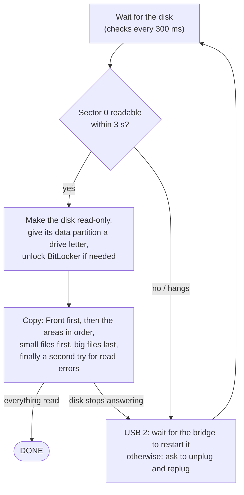

# Samsung 950 PRO Data Recovery

**Rescue the files from a disk that only works for a few seconds at a time - read-only, resumable, in an
automatic wait → copy → resume loop.**

A single Windows PowerShell script, no installation. It was written during a real rescue: a failing Samsung
950 PRO SSD that read for about 11 seconds after each power-on. 563 power cycles later, all 269,007 files
(159 GB) we wanted were saved - not one with a permanent read error. The name comes from that disk; the tool works
for any disk that fails the same way.

Deutsch: [README.de.md](README.de.md)

> [!CAUTION]
> **If a disk is failing right now:** switch it off and read [Is this the right tool?](#is-this-the-right-tool)
> and [Step by step](#step-by-step) before you connect it again. Do **not** run chkdsk or "Scan and fix", do
> **not** initialize or format it when Windows offers to, and do not keep working with it. Every minute it runs
> and every write can make things worse.

## Contents

- [Is this the right tool?](#is-this-the-right-tool)
- [What happened: the story behind this tool](#what-happened-the-story-behind-this-tool)
- [How it works](#how-it-works)
- [Requirements](#requirements)
- [Step by step](#step-by-step)
- [Automatic mounting and read-only: why they matter](#automatic-mounting-and-read-only-why-they-matter)
- [BitLocker](#bitlocker)
- [USB 2 or USB 3?](#usb-2-or-usb-3)
- [Internal slot: rescue at boot](#internal-slot-rescue-at-boot)
- [Reading the output](#reading-the-output)
- [What ends up in the target folder](#what-ends-up-in-the-target-folder)
- [Configuration](#configuration)
- [Command line](#command-line)
- [Tools and tests](#tools-and-tests)
- [Lessons learned](#lessons-learned)
- [Limitations](#limitations)
- [License](#license)

## Is this the right tool?

It is made for disks that **still work, but only for a short time**. Use it if all of these apply:

- After power-on the disk is **detected** with its correct name and size (in Disk Management, or with
  `.\Rescue-Disk.ps1 -ListDisks`).
- It **reads for a while** - seconds to a few minutes - and then **hangs or disappears**. Typical signs: Explorer
  freezes, the drive letter vanishes, Disk Management shows the disk as *Not initialized* or with 0 bytes, the
  System event log shows `disk` events 153 or 157 or controller resets.
- It **comes back after a power cycle**: unplugging the USB enclosure, or shutting the PC down and switching it
  on again.
- Its data partition has a **file system Windows can read** (tested with NTFS).

Typical candidates: SSDs with a failing controller or firmware, NVMe SSDs that drop off the bus, disks in USB
enclosures that disconnect after a while.

It is **not** the right tool when:

| Situation | Do this instead |
|---|---|
| A hard disk clicks, grinds, beeps, or spins up and down again and again | Switch it off at once - every start can damage it further. Go to a data recovery lab. |
| The disk is not detected at all, or with a wrong name or size (0 GB, "SATAFIRM S11", ...) | Its controller or firmware has failed. Data recovery lab. |
| The disk runs continuously, but some areas cannot be read | Make a sector image with retries, for example with [GNU ddrescue](https://www.gnu.org/software/ddrescue/) from a Linux live USB, and recover the files from the image. |
| Deleted files, a formatted or damaged partition | Work on an image with tools like [TestDisk/PhotoRec](https://www.cgsecurity.org/), never on the original. |
| Dynamic disks, Storage Spaces, RAID, Linux or macOS file systems | Not supported. |

If the data is irreplaceable and there is no backup, consider a professional lab first: this tool relies on
many power cycles, and every one of them is a risk for a dying disk.

## What happened: the story behind this tool

In September 2026 the data SSD of our laptop failed: a **Samsung 950 PRO 512 GB** (M.2 NVMe, from 2015),
encrypted with **BitLocker**, holding 159 GB in about 270,000 files - source code, documents, mail archives,
virtual machines.

It had given warnings. Windows' own records (see [`tools/Get-DiskHistory.ps1`](tools/Get-DiskHistory.ps1)) show
that it had dropped off the bus three times in early 2025 and once in June 2026, each time coming back after a
restart. On 24 September 2026 it failed for good: after every power-on it worked briefly, then hung and
disappeared. While it hung, Disk Management showed it as *Not initialized*.

**1. In the laptop, reading at boot.** In its slot the SSD died 66 to 100 seconds after power-on. A scheduled
task started the rescue at every boot to use that minute. It hardly worked: right after boot, Windows' storage
service often did not even know the disk yet, and a restart did not revive the SSD - it needed a full shutdown
and power-on every time.

**2. USB enclosure, USB 3.** We moved the SSD into a USB enclosure with a JMicron JMS583 USB-to-NVMe bridge. Now
it read for about 12 seconds per power cycle, then hung - and stayed hung until the enclosure was unplugged.
Restarting the USB port by software, or disabling and enabling the USB device, never revived it: the SSD kept its
power, and only a real power cut helped. So: unplug, plug in, 12 seconds, repeat.

**3. Same enclosure, USB 2.** The breakthrough. Over USB 2 the SSD still read for only about 11 seconds (at about
36 MB/s, the limit of USB 2) - but when it hung, the bridge chip restarted it by itself after Windows had reset
the USB device. The SSD dropped off and came back readable about ten seconds later, without anyone touching it.
From then on the rescue ran on its own: a new cycle about every 22 seconds, 30 to 40 GB per hour. In 468 cycles
over USB 2, the script had to ask for the cable to be replugged only 6 times.

The result:

| | |
|---|---|
| Files saved | **269,007 (159 GB)** - everything except folders we excluded on purpose because they exist elsewhere (repository clones, build output) |
| Files with permanent read errors | **0** |
| Reading cycles | 563 |
| Time the disk actually delivered data | 2 h 10 min in total |
| Duration | one afternoon and evening, plus 40 minutes the next day |

The partition was encrypted with BitLocker, and we were lucky: Windows unlocked it automatically every time it
appeared, because auto-unlock was on for this drive on this laptop. Without it, every cycle would have needed the
recovery key - see [BitLocker](#bitlocker).

The script grew during the rescue, version by version, out of what each failure taught us. This repository
contains the cleaned-up version: the same logic, with a configuration file instead of our folder names, English
messages and a self-test.

## How it works



- **Read-only.** Before anything is read through the file system, the script sets the disk's read-only attribute
  (`Set-Disk -IsReadOnly`); Windows remembers it for the next connections. Files are opened with read-only
  handles, and the script writes only below the target folder. The disk with Windows and the disk holding the
  target are never touched, and if more than one disk matches the configured name, the script stops instead of
  guessing.
- **Nothing is done twice.** `<Target>\_state` records the complete file list of each area as it is being listed
  (folder by folder), every finished file, and how far big files got (saved every 8 MB). When the disk comes
  back, the loop continues exactly where it stopped - also inside a file, and also when you stop the script and
  start it again days later.
- **A useful order.** First the `Front` files and folders (a password database, a mail archive, ...), in full.
  Then the `Areas` in the configured order, then the rest of the partition. Within an area small files first -
  the most files in the least time - then media files and disk images, then the folders marked as `Late`. Files
  larger than `BigMB` come in a final pass over all areas, and files that had read errors get a second try at the
  very end.
- **Fast reaction.** When the disk stops answering, Windows can take 40 seconds or more to give up on the read. A
  watchdog reports it after 3 seconds and, after `HangSeconds` (5), says what to do.
- **No getting stuck.** A read error puts the file aside for the second try. If the disk hangs three times at
  exactly the same position in a file, the file is put aside as well, so that one bad spot cannot block everything
  else; after three more hangs there, the script gives up on that file, so that the rescue can finish. The count
  survives restarts. Such files are listed in `_state\failed.tsv`.
- Copies keep the file's modification time. Files that are already on the target with the same size and time
  (for example from an earlier robocopy attempt) are not read again.

## Requirements

- Windows 10 or 11 with **Windows PowerShell 5.1** (part of Windows; PowerShell 7 has not been tested).
- **Administrator** rights.
- A **target drive** - not the dying disk, not a network share - with enough free space for everything you want to
  rescue. NTFS is recommended (large files, long paths).
- For USB: an enclosure or adapter that fits the disk (SATA or NVMe - check the M.2 key). Ideally a way to connect
  it with USB 2 as well, see [USB 2 or USB 3?](#usb-2-or-usb-3)
- For a BitLocker-encrypted disk from another PC: its 48-digit recovery key, see [BitLocker](#bitlocker).

## Step by step

### 1. Prepare the tool

Download this repository (**Code → Download ZIP**) and extract it on a healthy disk, for example to `C:\Tools`.
Open **Windows PowerShell as administrator** (Start menu → type `powershell` → *Run as administrator*) and go into
the extracted folder:

```powershell
cd C:\Tools\Samsung-950-Pro-Data-Recovery-main
Get-ChildItem -Recurse | Unblock-File                              # files from the internet are blocked
Set-ExecutionPolicy -Scope Process -ExecutionPolicy Bypass -Force  # allow scripts in this window only
```

Optional: check that the script works on this PC - without a disk, in a few seconds:

```powershell
.\tests\Test-RescueDisk.ps1
```

It should end with `All checks passed.`

### 2. Switch off automatic mounting - before you connect the disk

```powershell
.\Rescue-Disk.ps1 -Prepare
```

This runs `mountvol /N` (Windows no longer mounts new volumes and gives them no drive letter) and `mountvol /R`
(Windows forgets the drive letters of volumes that are not connected - including the old letter of the dying
disk). Without this, Windows gives the partition a drive letter the moment the disk appears, and Explorer,
AutoPlay, the virus scanner, the search indexer and Windows itself start using it - and possibly writing to it -
before anything has made it read-only. Details: [Automatic mounting and
read-only](#automatic-mounting-and-read-only-why-they-matter).

While automatic mounting is off, other newly connected drives (USB sticks too) get no drive letter either; give
them one in Disk Management if needed. Step 7 switches it back on.

If you later change how the dying disk is connected (another enclosure, or from USB to an internal slot), run
`-Prepare` again while it is disconnected.

### 3. Connect the disk and find its name

Connect the disk. If Windows offers to scan and fix, format, or initialize it: close or cancel - every time.
Then:

```powershell
.\Rescue-Disk.ps1 -ListDisks
```

```text
Disk            Vendor and product (-Model)              Notes
PhysicalDrive0  NVMe Samsung SSD 980 1TB                 system or target disk - never used
PhysicalDrive2  Samsung SSD 950 PRO                      USB port 13, USB 2, VID_152D&PID_0583
```

Note the name of the dying disk. It can differ between connections: our SSD was `NVMe Samsung SSD 950 PRO 512GB`
in the laptop and `Samsung SSD 950 PRO` in the USB enclosure, so we used `SSD 950 PRO`, which matches both. It
does not matter if the disk has dropped out again by now. `.\tools\Get-DiskHistory.ps1` shows the names of all
disks Windows has seen in the last year, also when they are not connected.

### 4. Write the configuration

Copy `rescue-config.example.psd1` to `rescue-config.psd1` in the same folder and edit it (Notepad will do). Only
`Model` and `Target` are active in it; the other settings are commented-out examples. The minimum:

```powershell
@{
    Model  = 'SSD 950 PRO'   # part of the name from -ListDisks (a regular expression)
    Target = 'E:\Rescue'     # a folder on another disk
}
```

Then tell it what matters most. All paths are relative to the root of the dying partition, without drive letter
(a path with a drive letter is refused - the copy would overwrite the original):

```powershell
    Areas   = @('Users\anna\Documents', 'Users\anna\Desktop', 'Projects')   # most important first
    Front   = @('Users\anna\Documents\passwords.kdbx')                      # first, in full, every cycle
    Late    = @{ 'Projects\old-archive' = 1 }                               # last in its area
    Exclude = @('Projects\third-party\chromium')                            # not at all
```

Areas make a big difference: without them, the script lists the whole partition before it copies the first file.
[`rescue-config.example.psd1`](rescue-config.example.psd1) explains every setting; see also
[Configuration](#configuration). Non-English characters in paths are fine, also when the editor saves the file as
UTF-8 without BOM.

Not sure about the folder names? Start with `Model` and `Target` only. The file lists land in
`<Target>\_state\inv_*.tsv` as soon as they are read (one line per file: `F`, path, size, time). Look at them, stop
the script with Ctrl+C, add `Areas`, and start it again. Nothing is lost: what has been listed or saved stays
listed and saved.

### 5. Start the rescue

```powershell
.\Rescue-Disk.ps1
```

Leave the window open. The script waits for the disk, makes it read-only, gives the partition the letter `R:`
(setting `Letter`) and copies until the disk stops answering. Then:

- **Over USB 2** it waits for the enclosure's bridge to restart the disk by itself: *The disk hangs - over USB 2 the
  USB bridge usually restarts it by itself, please wait a moment.* If the disk has not come back after about a
  minute, unplug it and plug it in again.
- **Otherwise** it asks: *Please unplug the disk and plug it in again - the rescue continues exactly where it
  stopped.* Unplug, wait about five seconds so that the disk really loses power, plug it in again.
- **In an internal slot:** see [Internal slot: rescue at boot](#internal-slot-rescue-at-boot).

After each cycle a summary line shows what was saved and what is still open (see [Reading the
output](#reading-the-output)). Everything except the progress and watchdog lines is also written to
`<Target>\rescue.log`.

You can stop at any time with **Ctrl+C** - preferably while it says *Waiting for the disk ...* - and start it
again later; it continues where it stopped. You can change the configuration in between (except `Target`).
`SkipDirs`, `SkipRootDirs` and removing an `Exclude` entry only affect folders that have not been listed yet.

While it runs: don't open the disk in Explorer or other programs (they would eat into its few seconds), and make
sure the PC does not go to sleep. A click into the window does not pause the script (it switches QuickEdit off
while it runs). Messages from Windows such as *Delayed Write Failed* for the rescued drive mean that Windows tried
to write to it and was refused - close them.

### 6. When it says DONE

```text
DONE - everything readable has been read. Files with permanent read errors: 0 (see _state\failed.tsv).
```

Check the result per folder:

```powershell
.\tools\Get-RescueReport.ps1 -Target E:\Rescue
```

`_state\failed.tsv` lists the files with permanent read errors and the position where reading failed; their
copies contain everything up to that point. Folders that could not be listed are in it as well, ending in `\`
(the DONE line then also says *folders that could not be listed: N*) - the files in them are missing. If you stop
before DONE, files that were interrupted are shorter on the target than on the disk; `Get-RescueReport.ps1 -List`
lists them.

### 7. Finish

```powershell
.\Rescue-Disk.ps1 -Finish
```

This switches automatic mounting back on (`mountvol /E`) and removes the autostart task, if you used one.
Disconnect the dying disk.

Then copy the files to their new home. The target folder has the same layout as the rescued partition, plus
`_state` and `rescue.log`:

```powershell
robocopy E:\Rescue D:\Restored /E /DCOPY:T /XD E:\Rescue\_state /XF E:\Rescue\rescue.log
.\tools\Get-RescueReport.ps1 -Target E:\Rescue -RestoredTo D:\Restored
```

Keep the rescue folder until you have checked everything.

## Automatic mounting and read-only: why they matter

A dying disk should be read, and only read. Every write makes the failing controller do more work, an interrupted
write can damage the file system further, and every second spent writing is lost for reading.

But Windows writes to disks on its own. When a partition appears, Windows gives it a drive letter and mounts it;
Explorer, AutoPlay, the virus scanner and the search indexer start reading it, and the file system itself may
write: NTFS flushes its journal and updates metadata, and BitLocker repairs its own metadata when it finds a
damaged copy.

That is not theory. Windows' event log from our rescue shows exactly this: NTFS tried to flush its transaction log
and to write to the `$MFT`, and after a failed read BitLocker started a "self-healing operation" on its metadata.
Windows refused all of it with *Write Protect Error* - the disk was read-only.

The script protects the disk in two ways:

1. **`-Prepare`, before the first connection:** automatic mounting off (`mountvol /N`), so that the partition gets
   no drive letter and is left alone, and old drive letters forgotten (`mountvol /R`), so that it does not get its
   old letter back either. Windows remembers drive letters per partition - also when the disk is suddenly
   connected via USB instead of internally. (The same with diskpart: `automount disable` and `automount scrub`.)
2. **The read-only attribute:** the script sets it before it gives the partition a drive letter. Windows remembers
   it for this disk: the next time the disk appears, it is read-only from the first moment and gets its drive
   letter `R:` right away, which saves time in every cycle.

A caveat from our event log: after the attribute had been set, the disk came up read-only by itself in 604 of 605
connections. Once it came up writable, for reasons we do not know, and was mounted for about three seconds until
the script set the attribute again - that is when the write attempts above happened. This is why the script
checks the attribute at every connection, and why `-Prepare` should be run again after changing the enclosure or
the connection: Windows stores the attribute per device as it is connected (in our case it was set for the USB
enclosure, but not for the internal slots), while it remembers the drive letter for the partition itself.

The attribute stays set for this disk on this PC after the rescue. You will hardly want to write to that disk
again, but if you do: `Set-Disk -Number <n> -IsReadOnly $false`.

## BitLocker

A partition encrypted with BitLocker must be unlocked before its files can be read. There are two cases.

**The disk comes from this PC, with auto-unlock on - our case.** For data drives, BitLocker can keep the key on
the PC, so that Windows unlocks the drive automatically whenever it appears ("auto-unlock"); managed company PCs
typically work like this. Then nothing needs to be done: each time our SSD came back it was already unlocked -
even when the script ran as SYSTEM at boot, before anyone had logged on. We confirmed it afterwards from Windows'
records: BitLocker events for the rescued partition, and the laptop's single auto-unlock entry, which dates from
the day the laptop was set up and belongs to none of its other drives.

That key lives in the Windows installation of that PC. Had the laptop failed as well, or had Windows been
reinstalled, the partition would have been locked.

**Any other case - another PC, a new Windows installation** - needs the **48-digit recovery key**. Where to find
it:

- personal Microsoft account: <https://aka.ms/myrecoverykey>
- work or school PC: your IT department, or <https://aka.ms/aadrecoverykey> (Microsoft Entra ID), or Active
  Directory
- a printout or a text file saved when BitLocker was switched on

Put the key into a text file (first line; dashes are optional), somewhere outside this folder, and point the
configuration to it:

```powershell
    BitLockerKeyFile = 'C:\Private\bitlocker-recovery.txt'
```

Without `BitLockerKeyFile` the script asks for the key once and keeps it in memory for all further cycles (the
autostart task cannot ask - it needs the file). It unlocks with `Unlock-BitLocker` (BitLocker PowerShell module, part of Windows Pro, Enterprise and Education).
Unlocking only needs to read from the disk - and the disk is read-only anyway. Delete the key file after the
rescue. If the BitLocker metadata on the disk is damaged, even the key will not help; then the next step is a
sector image and `repair-bde`, or a lab.

**Do not** switch on auto-unlock, add or remove key protectors, suspend or decrypt BitLocker on the dying disk:
all of that writes to the disk (and fails on a read-only disk anyway).

Tip for everybody, today: find the recovery keys of your drives while everything still works. In an
administrator PowerShell, `manage-bde -protectors -get D:` shows the recovery key of drive D:.

The unlock step has not been tested with a locked, dying disk - our disk never needed it.

## USB 2 or USB 3?

Our observations with the same SSD and the same enclosure (JMicron JMS583):

| | Internal slot (NVMe) | USB 3 | USB 2 |
|---|---|---|---|
| Reads after power-on for | 66-100 s | about 12 s | about 11 s |
| Then | dead until the PC is shut down and switched on | hangs until unplugged | the bridge restarts the SSD after about 10 s |
| Your part | shut down and switch on, every time | unplug and plug in, every time | almost nothing (6 of 468 cycles) |
| One cycle takes | several minutes | as long as you need | about 22 s |

So try both. If your enclosure restarts the disk by itself over USB 3 as well, stay with USB 3 - it is faster.
If the disk hangs until you unplug it, try USB 2: a USB 2 port on the PC, a USB 2 hub, or a USB 2 extension cable
between enclosure and PC. `-ListDisks` and the *Found the disk* line show which speed is in use, and the script
adapts: over USB 2 it waits up to 30 seconds for the bridge before it asks you to replug.

What did not help with our SSD - software instead of the cable: restarting the USB port
(`IOCTL_USB_HUB_CYCLE_PORT`) and disabling and enabling the USB device. Both only restart the USB side; the SSD
keeps its power. The script can still try both with `-PortRestart` (experimental) - other enclosures may cut the
power in that case.

## Internal slot: rescue at boot

If the disk can only be connected internally and dies soon after power-on, the script can start with Windows:

```powershell
.\Rescue-Disk.ps1 -InstallAutostart
```

This copies the script and `rescue-config.psd1` to `%ProgramData%\DiskRescue` (which only administrators can
change) and registers the scheduled task **DiskRescue**. It runs at every start as SYSTEM, waits up to 240
seconds for the disk and reads until it drops out. Then, again and again:

1. **Shut down completely** and switch the PC on again: `shutdown /s /t 0`. Not *Restart* - a restart may keep
   the disk powered, and ours was not even detected after a restart. And not simply *Shut down* in the Start menu
   if Fast Startup is on: then Windows only hibernates, and tasks that run at startup do not run.
2. Log on and watch the log: `Get-Content E:\Rescue\rescue.log -Wait -Tail 30`
3. When the disk has dropped out, repeat.

The task uses its own copy of the configuration: after changing `rescue-config.psd1`, run `-InstallAutostart`
again. While the task runs, a second instance of the script exits at once (*A rescue is already running*).
`.\Rescue-Disk.ps1 -RemoveAutostart` removes the task; `-Finish` does it too. Never use this for the disk Windows
runs from - connect such a disk to another PC.

## Reading the output

A cycle over USB 2 (shortened):

```text
21:14:02 (+ 812s since boot) Waiting for the disk ...
21:14:19 (+ 829s since boot) Found the disk: PhysicalDrive2 (Samsung SSD 950 PRO, USB port 13, USB 2, VID_152D&PID_0583).
21:14:19 (+ 829s since boot) Disk is read-only.
21:14:20 (+ 830s since boot) Reading from R:\ (read-only).
21:14:20 (+ 830s since boot) Area Users\anna\Documents ...
  1520 files / 245.3 MB in this cycle - last Users\anna\Documents\Offers\offer-17.docx
    21:14:34  disk has not answered for 3 s (Users\anna\Documents\Offers\scan.pdf)
    21:14:36  disk has not answered for 5 s (Users\anna\Documents\Offers\scan.pdf)
21:14:36 (+ 846s since boot) The disk hangs - over USB 2 the USB bridge usually restarts it by itself, please wait a moment.
21:14:41 (+ 851s since boot) Interrupted at Users\anna\Documents\Offers\scan.pdf
21:14:41 (+ 851s since boot) Cycle: 1612 files, 380.2 MB in 11 s (34.56 MB/s), then 10 s without an answer - 20344 files saved in total, 48,112 files (21.3 GB) still open, not listed yet: Projects, (rest of the partition).
21:14:41 (+ 851s since boot) The disk dropped out.
21:14:41 (+ 851s since boot) Waiting for the disk ...
```

- `(+ 829s since boot)` - time since Windows started; useful with the autostart task.
- `disk has not answered for N s (...)` - the watchdog: the disk hangs in the middle of this file or folder.
- `Cycle: ...` - what this cycle saved and how fast, how long the disk then did not answer, the totals, what is
  still open, and which areas have not been listed yet.
- Big files: `Copying X (10.29 GB), from 2.21 GB (22 %)` → `Interrupted at X: 2.62 of 10.29 GB (25 %) saved` →
  in a later cycle `done: X (10,537 MB)`.
- `Read error in X at 12.0 MB, will be retried later: ...` and `... was interrupted three times at the same
  position - deferred to the second pass at the end.` - the file gets its second try at the end. `... was
  interrupted six times at the same position - given up` - the script stops trying this file.
- `Listed X: 1843 files, 912.4 MB (skipped: 2 links, 40 cloud-only files)` - a finished file list. Symbolic links
  and junctions are not followed; files that exist only in the cloud (OneDrive "online-only") have no content on
  the disk.
- `Folder not readable, will be tried again at the end of the list: X (...)`, then possibly `Folder not readable,
  skipped: X (...)` - the folder goes to `failed.tsv`.
- `Front: X does not exist (or is done already).` - check the path in `Front`.
- `Preparation failed, nothing is read: ...` - for example a drive letter that is in use. If this happens three
  times in a row while the disk answers, the script stops.
- `R:\ is not readable (RAW?). Do NOT format it.` - Windows cannot read the file system (or it is a locked
  BitLocker partition). Never format it.

## What ends up in the target folder

```text
E:\Rescue\
├── Users\...             the rescued files, same layout as on the disk
├── Projects\...
├── rescue.log            everything the script reported
└── _state\
    ├── inv_<area>.tsv    complete file list of each area
    ├── done.tsv          finished files (path, bytes)
    ├── partial.tsv       how far interrupted files got (path, byte position; the last line counts)
    ├── failed.tsv        read errors (path, position, message; folders end in \ with position -1)
    ├── stuck.tsv         how often the disk hung at the same position of a file
    └── roots_done.txt    areas that are finished
```

The state files are UTF-8 text, tab-separated. In `inv_*.tsv`, `F` lines are files (path, size, modification
time as Windows file time), `D` folders, `X` folders that have been listed, and `E` marks a complete list.
Deleting `_state` means starting over - although files that are already on the target with the same size and
time are then recognized and not read again.

A file that was interrupted is shorter on the target until it is finished. Until the script says DONE,
`tools\Get-RescueReport.ps1` shows what is complete.

## Configuration

The configuration is a PowerShell data file: `rescue-config.psd1` next to the script, or any file given with
`-Config`. Parameters on the command line override it. Unknown settings are refused, so that a typo does not go
unnoticed, and so are paths with a drive letter or `..` in `Areas`, `Front`, `Late`, `Exclude`, `SkipRootDirs` and
`-First`: with a drive letter, the source and the copy would be the same file.
[`rescue-config.example.psd1`](rescue-config.example.psd1) is a commented example.

| Setting | Default | Meaning |
|---|---|---|
| `Model` | - | **Required.** Regular expression matched against the disk's name ("vendor product", see `-ListDisks`). The disk with Windows and the disk holding the target are never used; if more than one disk matches, the script stops. |
| `Target` | - | **Required.** Folder on another disk (local drive letter) for the copies, `_state` and `rescue.log`. |
| `Letter` | `R` | Drive letter for the rescued partition, if it has none. Must be free. |
| `Areas` | - | Folders to rescue first, in this order. Each is listed completely, then copied. A deeper folder can be an area before its parent. |
| `Front` | - | Files, or folders ending in `\`, copied first in every cycle and in full, whatever their size. A folder here is listed on its own, before all areas. |
| `Late` | - | Folder → rank 1-9, e.g. `@{ 'Projects\old' = 1 }`: copied after everything else of its area; higher ranks later. |
| `Exclude` | - | Folders not to rescue at all. Copies made before stay on the target. |
| `SkipDirs` | `node_modules`, `.venv`, `venv`, `__pycache__`, `obj`, `.next`, `.pytest_cache`, `.mypy_cache` | Folder names skipped everywhere (caches, build output). Setting it replaces this list. `.git`, `bin` and `dist` are copied. |
| `SkipRootDirs` | - | More folders in the partition root to skip. `System Volume Information`, `$RECYCLE.BIN` and `Config.Msi` are always skipped. |
| `LateExtensions` | `\.(wmv\|mp4\|avi\|mkv\|mov\|mpg\|iso\|vhdx?\|vmdk\|ova)$` | Files matching this regular expression come after the other files of their area. |
| `BigMB` | `500` | Files larger than this (MB) come in a final pass, after all smaller files. |
| `HangSeconds` | `5` | React after this many seconds without an answer from the disk; `0` = never. |
| `WaitSeconds` | `0` | How long to wait for the disk; `0` = forever. The autostart task uses 240. |
| `PortRestart` | `$false` | Experimental: restart the USB port and switch the USB device off and on, instead of asking to replug. |
| `OffSeconds` | `5` | With `PortRestart`: how long the USB device stays off. |
| `BitLockerKeyFile` | - | Text file whose first line is the 48-digit BitLocker recovery password. Keep it private. |

## Command line

| Parameter | Meaning |
|---|---|
| `-Config <file>` | Configuration file. Default: `rescue-config.psd1` next to the script. |
| `-Model`, `-Target`, `-Letter`, `-BigMB`, `-HangSeconds`, `-WaitSeconds`, `-PortRestart`, `-OffSeconds` | Same as the settings; override the configuration file. |
| `-First <folder>, ...` | Extra areas to rescue before the configured ones. |
| `-ListDisks` | Show the disks and their names, then exit. Needs no administrator rights. |
| `-Prepare` | Before connecting the dying disk: automatic mounting off, drive letters of absent volumes forgotten. |
| `-InstallAutostart` | Register the scheduled task that runs the rescue at every boot (internal disks). Needs a configuration file. |
| `-RemoveAutostart` | Remove the task. |
| `-Finish` | At the end: remove the task, switch automatic mounting back on. |
| `-TestSource <folder>` | Test mode: copy from a normal folder instead of a disk, one cycle, no administrator rights needed. |

`Get-Help .\Rescue-Disk.ps1 -Detailed` shows the same in the console.

## Tools and tests

- [`tools/Get-DiskHistory.ps1`](tools/Get-DiskHistory.ps1) - when did disks appear and disappear? It reads Windows'
  own records (event log *Microsoft-Windows-Partition/Diagnostic*, event 1006: every arrival and removal with
  model, serial number, bus, size and the number of readable partitions; 0 partitions = removed or unreadable).
  `-Errors` adds disk and controller warnings from the System log: retried and failed I/O, surprise removals,
  controller resets. Needs no administrator rights. A good first look at a suspicious disk - and if it shows
  dropouts, a reason to make a backup today.

  ```powershell
  .\tools\Get-DiskHistory.ps1 -Model '950' -Days 90 -Errors
  ```

- [`tools/Get-RescueReport.ps1`](tools/Get-RescueReport.ps1) - per folder: how many files the disk had (from the
  file lists) and how many are saved completely. With `-RestoredTo`, also whether a copy made from the rescue is
  complete; `-List` names every missing or incomplete file. Reads only.
- [`tests/Test-RescueDisk.ps1`](tests/Test-RescueDisk.ps1) - self-test in test mode: it builds a folder tree, runs
  the rescue several times and checks the order, Front, Areas, Late, Exclude, SkipDirs, resuming after "lost"
  files, existing copies, a file name with invalid Unicode, a configuration with umlauts saved without BOM, a
  junction, a folder that cannot be listed, a path with a drive letter in the configuration and a restart after an
  interrupted file list. `-BigFile` adds a 3 GB file (needs 3 GB free in `%TEMP%`). Needs no administrator rights.

With `-TestSource` you can also try the rescue on any normal folder:
`.\Rescue-Disk.ps1 -TestSource C:\SomeFolder -Target C:\Temp\RescueTest`.

## Lessons learned

- **Take the first dropout seriously.** Our SSD had disappeared four times before it failed.
  `tools/Get-DiskHistory.ps1` shows such a history in seconds. A backup after the first dropout would have spared
  us all of this.
- **Robocopy and Explorer are the wrong tools for a disk that works for seconds.** They start big files from the
  beginning again after every failure, do not remember across power cycles what is done, and wait a long time for
  a hanging read.
- **List first, and save the list.** A folder that has been listed does not need to be read again in the next
  cycle.
- **Small files first.** Most files - and much of the irreplaceable work - are small. Sorting by size gets the
  most files out of every cycle.
- **Resume inside files.** A 10 GB virtual disk at 36 MB/s and 11 seconds per cycle needs about 26 cycles. Without
  resuming inside the file it would never finish.
- **Try USB 2.** The same enclosure behaved completely differently over USB 2 and USB 3; USB 2 made the rescue run
  by itself.
- **Only a real power cut revived our SSD.** USB port restarts, disabling and enabling the device, and restarting
  Windows did not help; unplugging and shutting down did.
- **Keeping the disk busy did not help.** We tried to prevent the hang with constant small reads; it hung anyway.
- **Right after boot, Windows' storage service may not know the disk yet.** Our first attempts failed on that; the
  script now refreshes and retries.
- **Automatic mounting off, read-only before mounting.** Windows does try to write to a damaged disk, see
  [above](#automatic-mounting-and-read-only-why-they-matter).
- **Know where your BitLocker recovery keys are.** Auto-unlock saved us - and it only works on the PC that holds
  the key.

## Limitations

- Windows only; Windows PowerShell 5.1; administrator rights.
- Rescues the largest data partition of the disk (GPT "basic data", or FAT, NTFS or exFAT on MBR disks; a data
  disk normally has one, plus small hidden ones). Only the GPT case has met a dying disk so far. Dynamic disks,
  Storage Spaces and RAID are not supported.
- Works on the file level: the file system must be readable by Windows. No deleted files, no sector image.
- Copies file contents and modification times. Not copied: permissions, attributes (hidden, read-only), creation
  times, alternate data streams, empty folders. Symbolic links and junctions are skipped (not followed), and so are
  files that exist only in the cloud (their content is not on the disk).
- The target must be a folder on a local drive with a drive letter.
- One rescue at a time per PC.
- The published script is the cleaned-up version of the one that did our rescue. The copy logic, the state files
  and resuming are covered by the self-test; the disk-related parts (detection, read-only, drive letter,
  watchdog) did our rescue in their earlier form but have not met a dying disk again since the cleanup, and the
  BitLocker unlock has never been tested with a locked, dying disk. If there is time, do a dry run with a healthy
  spare USB disk first: set `Model` to its name, run the steps above, and afterwards make it writable again with
  `Set-Disk -Number <n> -IsReadOnly $false` and switch automatic mounting back on with `-Finish`.
- `-PortRestart` is experimental.

## License

[MIT](LICENSE) © 2026 HUBERION.

This software comes **without any warranty**. Using it on a failing disk is at your own risk; the authors are not
liable for lost data or damaged hardware. If the data is valuable, consider a professional data recovery service
first.

Written by HUBERION during a real rescue, together with [Claude Code](https://claude.com/claude-code).
